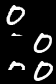
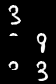
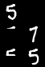
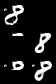

Keras based ML algorithms
=========================

There are some machine learning algorithms of simple version by Keras    

- file structure    
    - actor_critic    
        - Actor-critic based algorithm    
        - It is explain how can setting custom gradient    
        - Atari breakout game    
    - attention    
        - Simple attention work    
        - It is translate date format(ex. 2019-10-19 -> Octorber 10, 2019)    
    - VAE(Variational Autoencoder)    
        - Simple VAE
        - Encode and Decode MNIST case
    - RNN    
        - Predict sequence data    
        - Include GRU example     
        - MNIST data prediction    
            
        From above, origianl, predict 70% data from 30% original, predict 50% data from 50% original
